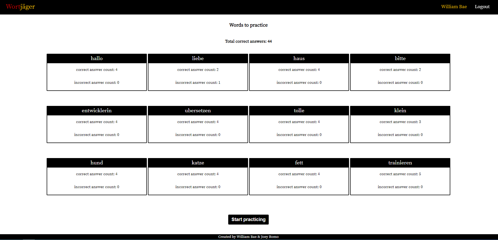

# Wortjäger (Spaced Repetition) Capstone

## Authors
* William Bae | Github: wbae912
* Joey Romo | Github: joeyjr95

Client:
* Live Link to application: https://william-joey-wortjager-app.now.sh
* Link to application repository: https://github.com/thinkful-ei-gecko/william-joey-spaced-repetition-client

Server:
* Live Link to server: https://glacial-sands-91061.herokuapp.com
* Link to server repository: https://github.com/thinkful-ei-gecko/william-joey-spaced-repetition-server

Demo Account for Client:
* Demo username: admin
* Demo password: pass


## Description
Wortjäger is a React application that teaches users simple German words via spaced repetition. German words are displayed on the page and users are expected to provide the correct English translation of the word. Spaced repetition works by more frequently showing words that users get wrong and less frequently displaying words that users answer correctly.


## Screenshots
#### Registration Page (Once user successfully creates an account they are directed to Login page)


#### Login Page (Once user successfully logs in they are directed to the Dashboard page)


#### Dashboard


#### Learning Page (Displays the German word that the user is expected to provide the English translation for)


#### Feedback Page (Given a CORRECT answer)


#### Feedback Page (Given an INCORRECT answer)


## Technologies
* HTML5
* CSS3
* ReactJS


## Local Dev Setup
To setup the application

1. Fork and clone the project to your machine
2. `npm install`. This will also install the application *Cypress.io* for running browser integration tests

The project expects you have the Spaced repetition API project setup and running on http://localhost:8000.

Find instructions to setup the API here https://github.com/Thinkful-Ed/spaced-repetition-api.

## Running project

This is a `create-react-app` project so `npm start` will start the project in development mode with hot reloading by default.

## Running the tests

This project uses [Cypress IO](https://docs.cypress.io) for integration testing using the Chrome browser.

Cypress has the following expectations:

- You have cypress installed (this is a devDependency of the project)
- You have your application running at http://localhost:3000.
  - You can change the address of this expectation in the `./cypress.json` file.
- Your `./src/config.js` is using http://localhost:8000/api as the `API_ENDPOINT`

To start the tests run the command:

```bash
npm run cypress:open
```

On the first run of this command, the cypress application will verify its install. Any other runs after this, the verification will be skipped.

The command will open up the Cypress application which reads tests from the `./cypress/integration/` directory. You can then run individual tests by clicking on the file names or run all tests by clicking the "run all tests" button in the cypress GUI.

Tests will assert against your running localhost client application.

You can also start all of the tests in the command line only (not using the GUI) by running the command:

```bash
npm run cypress:run
```

This will save video recordings of the test runs in the directory `./cypress/videos/`.